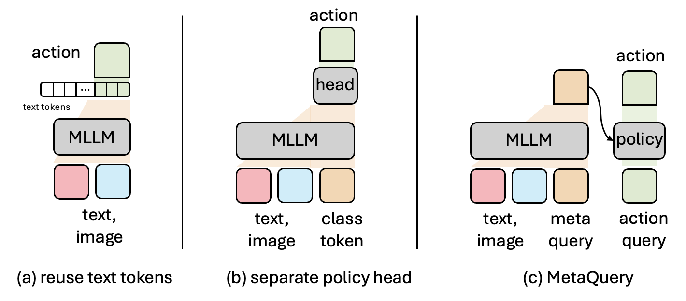
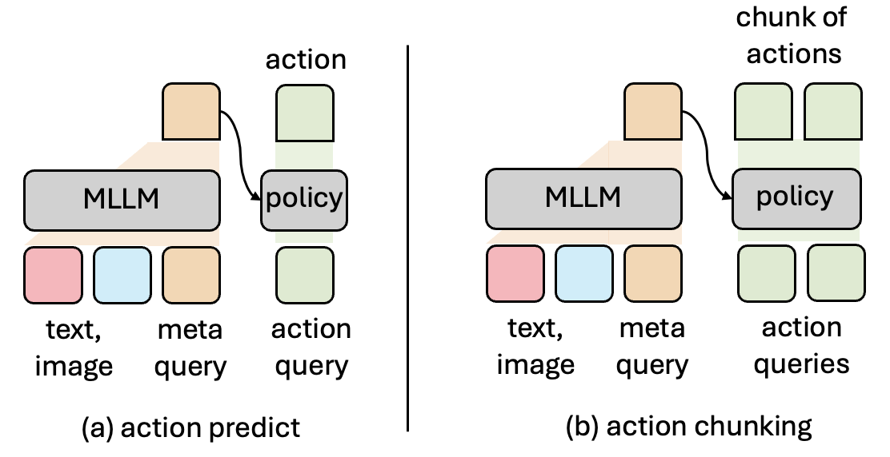
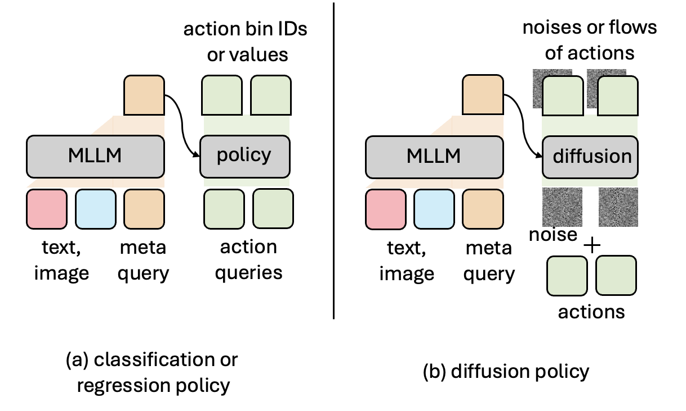
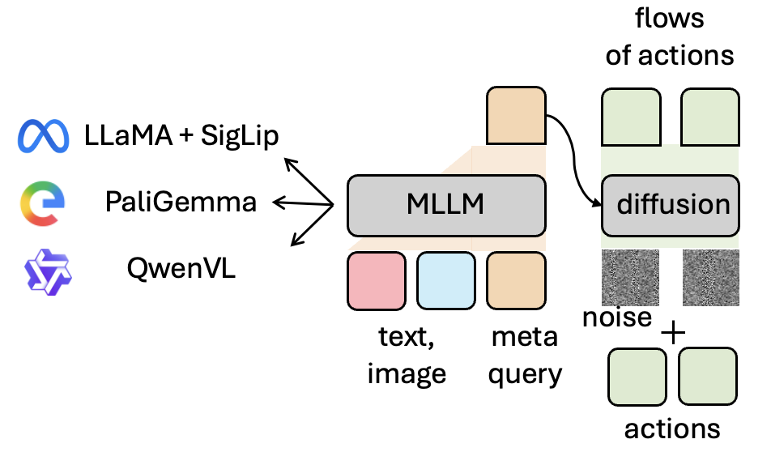
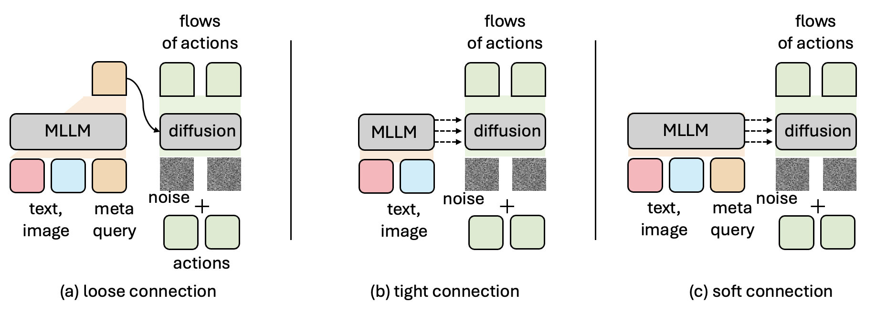
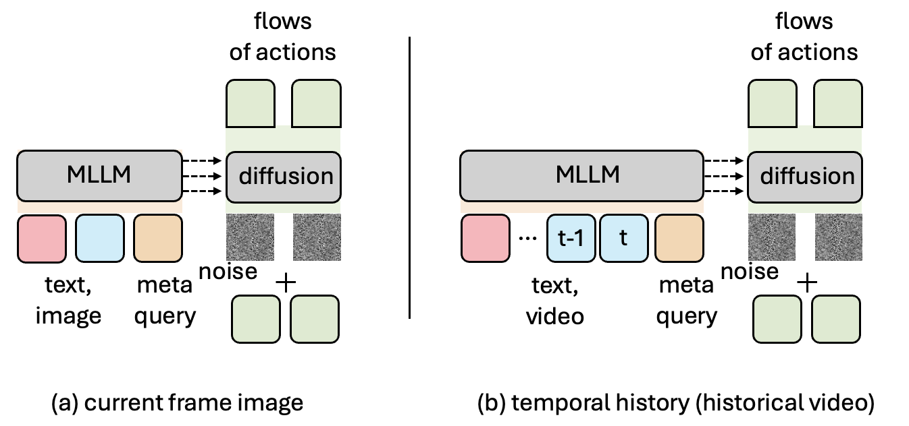
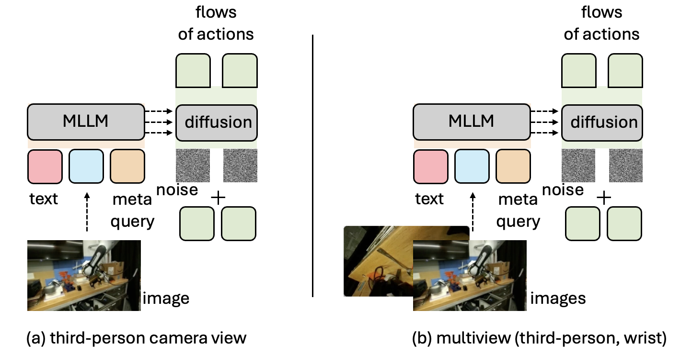
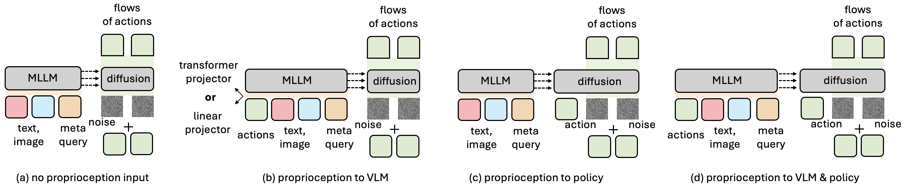
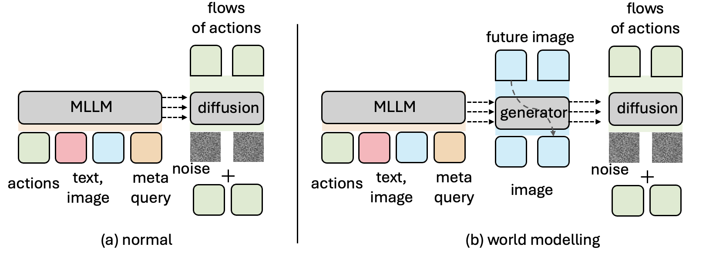
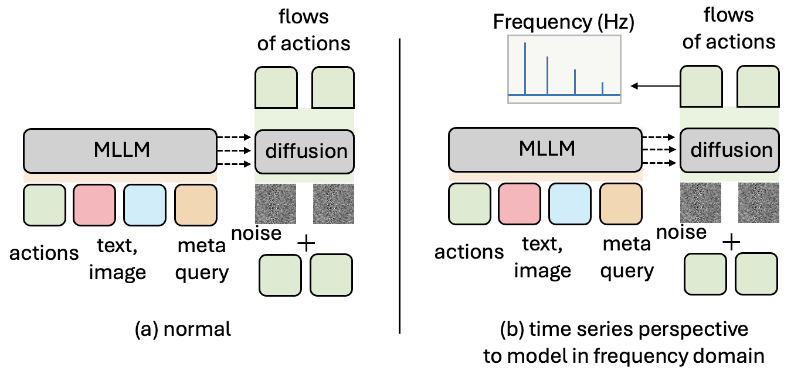

# VLANeXt Design Space Exploration

This document serves as a comprehensive guide for configuring and extending the **12 key design spaces** explored in our paper. This framework allows you to reproduce our ablation studies or customize the VLA architecture for your specific robotics tasks.

All configurations are primarily managed via the YAML files in `config/[dataset_name]_train_config.yaml` (e.g., `libero_train_config.yaml`, `droid_train_config.yaml`).

---

### 1. Policy Type
**Design:** Two types of policy designs: **(a)** reusing the VLM's text token outputs directly for action prediction (RT-2-like baseline), or **(b)** applying a **separate policy module** (a dedicated Transformer) that takes VLM features as conditioning. In our final VLANeXt, we use a separate policy module.

#### Configuration
```yaml
model:
  # "vlanext" → separate policy module (VLANeXt)
  # "rt2_baseline" → reuses the VLM text tokens for classification (RT-2-like)
  model_type: "vlanext"  # Options: "vlanext", "rt2_baseline"
```

#### Implementation Details
- **`model_type: "vlanext"`** instantiates the `VLANeXt` class (`src/models/VLANeXt.py`), which composes a VLM backbone with a separate action head (e.g., `ActionDiffusionTransformerMoE`). The VLM produces conditioning features, and the policy module independently generates actions.
- **`model_type: "rt2_baseline"`** instantiates the `RT2LikeBaseline` class (`src/models/rt2_like_baseline.py`). Actions are predicted by reusing the least frequently used text tokens in the LLM vocabulary as discrete action bins, similar to the RT-2 approach.

#### How to Extend
Add a new model class (e.g., `MyCustomPolicy`) in `src/models/`, add a new branch in `train.py`'s `train()` function under the `model_type` check, and update `get_vla()` in `src/evaluation/libero_bench/VLANeXt_utils.py` to instantiate the new model during evaluation.

<p align="center">

</p>

---

### 2. Policy Size
**Design:** Scaling the policy network independently of the VLM backbone. In our final VLANeXt, we use 29 layers with hidden size 1024, same depth as the VLM (Qwen3-VL 2B) we used.

#### Configuration
```yaml
model:
  policy_hidden_size: 1024   # Hidden dimension of the policy Transformer
  policy_depth: 29           # Number of Transformer layers in the policy
  policy_num_heads: 16       # Number of attention heads
  policy_mlp_ratio: 4.0      # MLP hidden dim = policy_hidden_size * policy_mlp_ratio
```

---

### 3. Action Chunking
**Design:** Predicting a sequence of future actions ($k$ steps) to improve temporal consistency and smoothness. In our final VLANeXt, we use the action chunk size of 8.

#### Configuration
```yaml
data:
  future_len: 8    # Number of future action steps to predict (action chunk size)
```

<p align="center">

</p>

---

### 4. Loss Choices
**Design:** Objective functions for action prediction: classification (binning, VQ-VAE), regression, and diffusion (DDIM, flow matching). In our final VLANeXt, we use flow matching diffusion loss.

#### Configuration
```yaml
model:
  # Primary loss type
  loss_type: "diffusion"         # Options: "diffusion", "regression", "classification"

  # Diffusion-specific settings (applicable if loss_type is "diffusion")
  num_train_timesteps: 1000      # Number of diffusion training timesteps
  num_inference_timesteps: 10    # Number of denoising steps at inference
  scheduler_type: "flow_match"   # Options: "ddim", "flow_match"

  # Classification-specific settings (applicable if loss_type is "classification")
  num_bins: 256                  # Number of discretization bins per action dimension
  action_vqvae:                  # VQ-VAE tokenizer for classification (alternative to binning)
    enabled: false               # Set to true to use VQ-VAE instead of per-dim binning
    frozen: true                 # Freeze VQ-VAE after pretraining
    codebook_size: 1024
    hidden_size: 256
    depth: 4
    num_heads: 8
    steps: 1000                  # VQ-VAE pretraining steps
    learning_rate: 1.0e-3
```

#### Implementation Details
- **`"regression"`**: Direct MSE loss between predicted and ground-truth action sequences.
- **`"diffusion"`**: With `scheduler_type: "flow_match"`, training uses rectified flow matching (linear interpolation between data and noise); with `"ddim"`, standard DDIM epsilon-prediction is used.
- **`"classification"`**: When `action_vqvae` is disable, discretizes each action dimension into `num_bins` bins and applies cross-entropy loss. Alternatively, enable `action_vqvae` to first learn a VQ-VAE codebook over action sequences, then classify into codebook indices. When VQ-VAE is enabled, a pretraining phase runs before main training (controlled by `action_vqvae.steps`).

#### How to Extend
To add a completely new loss type, implement a `_forward_<loss_name>` method in `VLANeXt` and add new policy classes in `src/models/policies.py` (we seperately implement different policies for each loss, e.g., diffusion policies, regression policies, classification policies). You should also update the `predict_action` method in `VLANeXt.py` to handle inference for the new loss type, and ensure `get_vlanext_action` in `src/evaluation/libero_bench/VLANeXt_utils.py` correctly processes the output.

<p align="center">

</p>

---

### 5. VLM Choices
**Design:** The choice of the vision-language model backbone. In our final VLANeXt, we use Qwen3-VL 2B.

#### Configuration
```yaml
model:
  # VLM backbone path (Hugging Face model ID)
  lmm_path: "Qwen/Qwen3-VL-2B-Instruct"
  # Options: "Qwen/Qwen3-VL-2B-Instruct", "Qwen/Qwen3-VL-4B-Instruct",
  #          "google/paligemma-3b-pt-224", 
  #          "meta-llama/Llama-3.2-3B",

  # Vision encoder path (only applicable for Llama-based VLMs)
  vision_encoder_path: "google/siglip2-base-patch16-256"

  # Backbone training mode
  backbone_mode: "finetune"      # Options: "frozen", "finetune"
```

#### Implementation Details
The `VLANeXt.__init__()` method detects the model family from the `lmm_path` string:
- **`"qwen"`**: Loads `Qwen3VLForConditionalGeneration` with its built-in vision encoder, which supports both image and video inputs natively.
- **`"paligemma"`**: Loads `PaliGemmaForConditionalGeneration` with its built-in SigLIP vision encoder.
- **`"llama"`**: Loads `LlamaForCausalLM` as a text-only LLM, plus a separate `SiglipVisionModel` (controlled by `vision_encoder_path`) with a learnable MLP vision projector.
- **`backbone_mode: "frozen"`** freezes the VLM weights; `"finetune"` keeps them trainable.

#### How to Extend
To add a new VLM family, add a new `elif` branch in `VLANeXt.__init__()` for loading the model and processor, implement a `_get_vlm_condition_<family>()` method, update `DataCollatorForVLANeXt` in `train.py`, and modify `get_processor` and `get_vlanext_action` in `src/evaluation/libero_bench/VLANeXt_utils.py` to handle the new VLM's processing logic during evaluation.


<p align="center">

</p>

---

### 6. VLM-Policy Connection Choices
**Design:** How to bridge the semantic space of the VLM with the control space of the policy. In our final VLANeXt, we use a **"soft"** connection, connecting VLM with policy module layer-by-layer but inserting learnable queries as a latent buffer between the modules.

#### Configuration
```yaml
model:
  # Connection type between VLM and policy
  condition_type: "soft"         # Options: "loose", "tight", "soft"

  # Number of learnable meta-queries (for "loose" and "soft" modes)
  num_queries: 16

  # Connector settings (only applicable for "loose" condition_type)
  use_transformer_connector: true
  connector_depth: 2
  connector_num_heads: 4
```

#### Implementation Details
- **`"loose"`**: Appends `num_queries` learnable meta-query tokens to the VLM input. After VLM forward pass, the output at meta-query positions is extracted and passed through a `ConnectorTransformer` (`src/models/connector.py`). The connector output is mean-pooled into a single conditioning vector, which is fed to the policy's `MetaQueryBlock`-based Transformer (e.g., `ActionDiffusionTransformerMetaquery`). If `use_transformer_connector: false`, a simple 2-layer MLP is used instead.
- **`"tight"`**: Directly passes **all VLM hidden states** (one per layer) to the policy. No meta-queries are appended. The policy uses `MoEBlock`-based Transformers (e.g., `ActionDiffusionTransformerMoE`) where each policy layer cross-attends to the corresponding VLM layer's hidden states.
- **`"soft"`** *(VLANeXt default)*: Combines both approaches — appends `num_queries` learnable meta-queries to the VLM input (like "loose"), **and** passes all VLM hidden states layer-by-layer to the policy (like "tight"). This provides both a dedicated latent buffer and rich per-layer features. Uses `MoEBlock`-based policy Transformers.

#### How to Extend
To add a new connection type, implement the conditioning logic in all the `_get_vlm_condition_[VLMname]()` methods to get revalant conditioning information from VLM, and add corresponding branches in `_forward_diffusion()`, `_forward_regression()`, `_forward_classification()`, and `predict_action()` of `VLANeXt` for both training and inference.

<p align="center">

</p>

---

### 7. Temporal History
**Design:** Whether to use past history visual observations as input. In our final VLANeXt, we only use the current frame image as input (no video history).

#### Configuration
```yaml
data:
  # "image" → only the current frame (no temporal history)
  # "video" → a sequence of past frames as video input
  input_modality: "image"        # Options: "video", "image"

  # Number of past timesteps (applicable to video input and proprioception)
  history_len: 8
```

#### Implementation Details
- **`input_modality: "image"`**: The `DataCollatorForVLANeXt` loads only the current frame (`sample["image"]`) and passes it to the processor as a single image.
- **`input_modality: "video"`**: The collator loads `sample["video"]` — a sequence of `history_len` past frames — and passes them as video input.

#### How to Extend
To add a new temporal strategy (e.g., key-frame sampling), modify `__getitem__()` in the dataset class, and also update the history construction logic in `get_vlanext_action()` in `src/evaluation/libero_bench/VLANeXt_utils.py` to match behavior.


<p align="center">

</p>


---

### 8. View
**Design:** Using single vs. multi-view (wrist + third-person) visual inputs. In our final VLANeXt, we use multi-view visual inputs.

#### Configuration
```yaml
data:
  # "single" → only the third-person camera view
  # "multi" → both third-person and wrist camera views
  view_mode: "multi"             # Options: "single", "multi"
```

#### Implementation Details
- **`view_mode: "single"`**: Only `sample["image"]` (or `sample["video"]`) is loaded — typically the third-person camera view.
- **`view_mode: "multi"`**: Both `sample["image"]` and `sample["image_wrist"]` (or `sample["video"]` and `sample["video_wrist"]`) are loaded.

<p align="center">

</p>

---

### 9. Proprioception Condition
**Design:** Whether and how to condition on proprioception for action generation. In our final VLANeXt, we feed proprioception into the VLM.

#### Configuration
```yaml
model:
  # Feed proprioception history as input tokens into the VLM
  use_proprio_input_vlm: true

  # Feed past action history as input to the policy module
  use_action_input_policy: false
```


#### Implementation Details
- **`use_proprio_input_vlm: true`**: The proprioception sequence `(B, history_len, action_dim)` is projected via `action_projector` into VLM embedding space and **prepended** to the VLM input embeddings. The VLM processes these as additional input tokens alongside vision and text tokens. This allows the VLM to incorporate robot state information into its representations.
- **`use_action_input_policy: true`**: Past action history is passed directly to the policy module.
- Both can be enabled simultaneously for maximum conditioning.

<p align="center">

</p>

---

### 10. Proprioception Projector
**Design:** Architecture used to encode proprioception into VLM-compatible embeddings. In our final VLANeXt, we simply use a Linear projector.

#### Configuration
```yaml
model:
  # Use a Transformer-based projector (true) or a simple Linear layer (false)
  use_transformer_proprio_projector: false

  # Transformer projector settings (only if use_transformer_proprio_projector is true)
  projector_depth: 2
  projector_num_heads: 4
```

#### Implementation Details
- **`use_transformer_proprio_projector: false`** *(VLANeXt default)*: A single `nn.Linear(action_dim, hidden_size)` layer projects each proprioception timestep independently into VLM embedding space.
- **`use_transformer_proprio_projector: true`**: Uses `ActionTransformerProjector` (`src/models/encoder.py`), a full Transformer encoder with learnable positional embeddings, `projector_depth` layers, and `projector_num_heads` attention heads. This enables temporal reasoning across proprioception timesteps before feeding into the VLM.

---

### 11. World Modelling
**Design:** Adding an auxiliary objective to predict future visual observations alongside actions. In our final VLANeXt, we don't use this design (weight set to 0).

#### Configuration
```yaml
model:
  # Auxiliary future image prediction loss weight (set > 0 to activate)
  future_image_loss_weight: 0.0

  # Future image prediction architecture settings
  generator_hidden_size: 768
  generator_depth: 29            # Options: 12 (base), 29 (large), 36 (x-large)
  generator_num_heads: 12
  generator_mlp_ratio: 4.0

data:
  # How to select the future target image
  future_image_mode: "horizon"   # Options: "horizon", "last"
```


#### Implementation Details
- When `future_image_loss_weight > 0`, the model loads a frozen **Emu3.5 VisionTokenizer** (`Emu3p5VisionVQModel`) to encode future images into discrete visual tokens.
- An `ImageGeneratorTransformer` (`src/models/generator.py`) is trained autoregressively to predict these visual tokens, conditioned on VLM hidden states via layer-wise cross-attention.
- The total loss becomes: `loss = action_loss + future_image_loss_weight * image_generation_loss`.
- `future_image_mode: "horizon"` uses the image at the end of the action chunk horizon; `"last"` can select the final frame of the episode.

<p align="center">

</p>

---

### 12. Frequency Modelling
**Design:** Adding an auxiliary objective to predict actions in the frequency domain (DCT) alongside the original time-domain loss. In our final VLANeXt, we use this design.

#### Configuration
```yaml
model:
  # Auxiliary DCT loss weight (set > 0 to activate)
  dct_loss_weight: 0.1

  # Fraction of DCT coefficients treated as low-frequency (0.0–1.0)
  dct_freq_split: 0.125
  # Per-band loss weights
  dct_low_freq_weight: 1.0
  dct_high_freq_weight: 1.0
  # Similarity metric for DCT loss
  dct_similarity_type: "mse"     # Options: "mse", "mae", "cosine"
```

#### Implementation Details
- When `dct_loss_weight > 0`, a **Discrete Cosine Transform (DCT)** loss is computed in addition to the primary action loss.
- For **diffusion** loss, the clean action estimate $\hat{x}_0$ is first recovered from the noisy prediction (via the reparameterization formula for both flow matching and DDIM), then the DCT loss is applied on $\hat{x}_0$ vs. the ground-truth actions.
- For **regression** loss, the DCT loss is directly computed on the predicted vs. ground-truth actions.
- For **classification** loss, soft action predictions are obtained from the logit probabilities (expected value over bin centers or VQ-VAE soft decoding), then the DCT loss is applied.
- `dct_freq_split` controls the boundary between low- and high-frequency bands; `dct_low_freq_weight` and `dct_high_freq_weight` scale the loss contribution of each band independently. When action chunk is 8, using 0.125 or 0.25 split works good. Low frequencies are more helpful than high frequencies.
- `dct_similarity_type` selects the per-element distance metric applied in the DCT domain: `"mse"` (squared error), `"mae"` (absolute error), or `"cosine"` (cosine distance). Note that `"cosine"` may require a smaller `dct_loss_weight` for stable training. 
- The total loss becomes: `loss = primary_loss + dct_loss_weight * dct_loss`.

<p align="center">

</p>