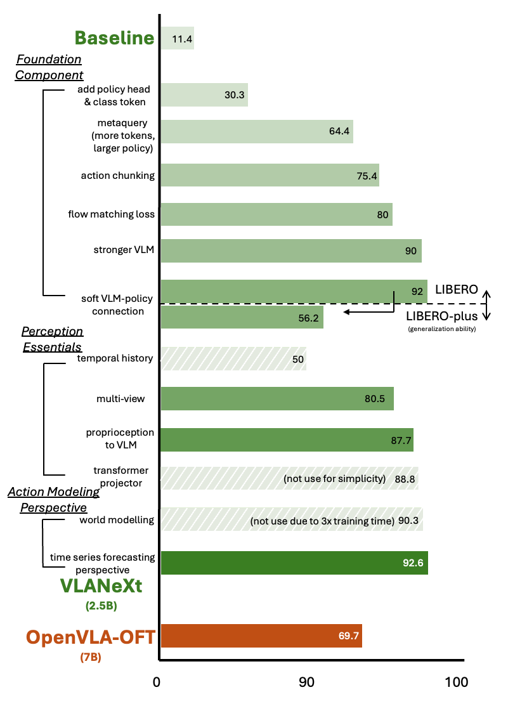
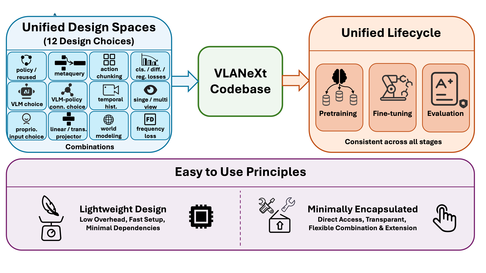

# VLANeXt: Recipes for Building Strong VLA Models

[](<LINK>)
[](https://dravenalg.github.io/VLANeXt)
[](https://github.com/DravenALG/awesome-vla)

<p align="center">

</p>

This is a PyTorch implementation of the paper: [VLANeXt: Recipes for Building Strong VLA Models](), and also a **unified**, **easy-to-use** codebase that standardizes training and evaluation while exposing the key components of the VLA design space. It is intentionally lightweight and minimally encapsulated, enabling researchers to reproduce results, probe alternative design choices, and build new VLA variants on a shared, transparent foundation. We also release a [curated and continuously updated list of VLA research](https://github.com/DravenALG/awesome-vla) (Awesome VLA) to help better understand the development of VLAs.

<p align="center">

</p>

**Xiao-Ming Wu**, Bin Fan, Kang Liao, Jian-Jian Jiang, Runze Yang, Yihang Luo, Zhonghua Wu, Wei-Shi Zheng, Chen Change Loy*.

If you have any questions, feel free to contact me by xiaoming.wu@ntu.edu.sg.

## Installation

## Train
<p align="center">

</p>

Our final version of VLANeXt can be trained using config

## Evaluation

## Citation
If you find VLANeXt and the codebase useful for your research or applications, please cite our paper using the following BibTeX:

```bibtex

```

## License

This project is released under the S-Lab License 1.0. Please refer to [LICENSE](LICENSE) for details.

